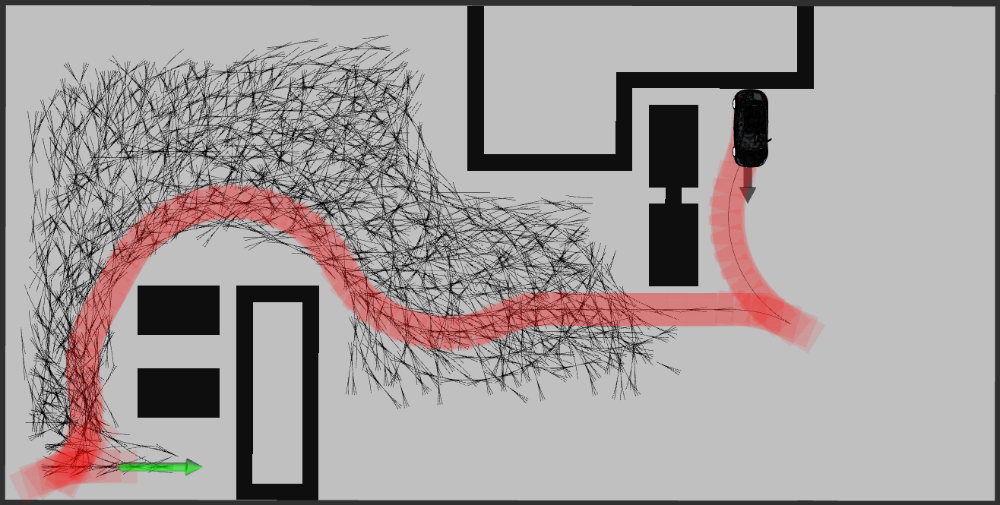
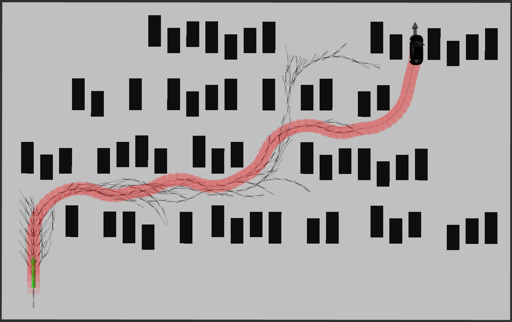
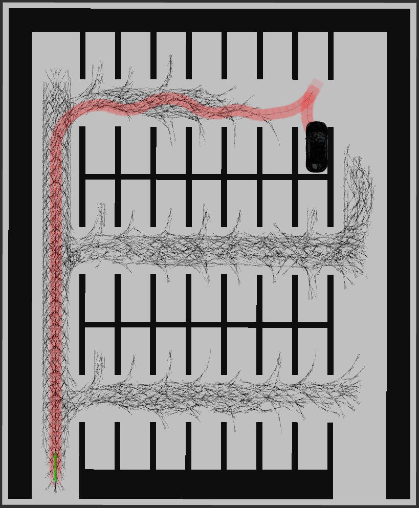

# Hybrid-Astar-AVP
## 1. Introduction
The path planning problem in autonomous vehicles, particularly in open spaces  without clear tracking paths or indication lines, is a crucial issue to be addressed. One  of the most significant situations in this scenario is empty parking lots, where vehicles  could save time and energy consumption by finding a shortest path from the start  point to the goal point while avoiding obstacles.
 
This project proposes a solution to the path planning problem using a hybrid A*  algorithm and Reeds Shepp Path searching on a given 2D map with obstacles. With  the path generated by hybrid A* algorithm, different heuristic functions are tested  with three different scenarios. Visualization tools are also provided for researchers to  simulate the algorithm intuitively. The result of this work shows that using  unconstrained heuristics that consider obstacles is more efficient in terms of path  length. Additionally, it enhances driving comfort when incorporated with Reeds  Shepp curves.
## 2. Images




## 3. Setup

 (1). **Set up dependence :**

 Eigen 3:
 
```shell
sudo apt-get install libeigen3-dev
```

(2). **Clone to a new folder**

```shell
mkdir catkin_ws
cd catkin_ws
git clone https://github.com/Hu-Yichen/Hybrid-Astar-AVP.git
```

(3). **Build**

```shell
cd hybrid_astar
carkin_make
source devel/setup.bash
```

(3). **Launch hybrid A star**

```shell
roslaunch hybrid_astar run_hybrid_a_star.launch
```
